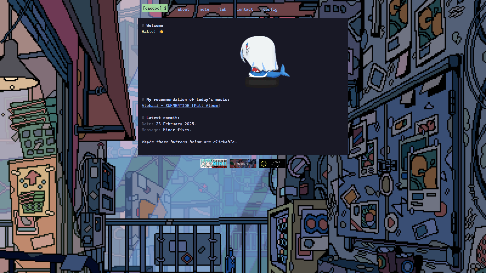

# caodoc.github.io

## Preview
### Main page

### 404 page

## Settings
Currently, you can toogle website's animated background ON/OFF, change theme color (base16) between dark and light mode.

## Assets
+ GitHub's avatar by [花铭](https://www.pixiv.net/en/users/70483399) on pixiv.
+ [./about](/about) image by [asahi](https://imgur.com/asahi-wKjtZg3).
+ Animated background by [WANEELLA](https://waneella.tumblr.com/).
+ [404NotFound.png](/media/404NotFound.png) from [vtuberlogos.alfon.dev](https://vtuberlogos.alfon.dev/).
+ I made [caodoc](/assets/caodoc-webring.png) & [NCS](/assets/ncs.gif) buttons, the other one was taken from [here](https://cyber.dabamos.de/88x31/).
+ Language icons from [xandemon.github.io/developer-icons](https://xandemon.github.io/developer-icons/).

## Page
+ Hosting on [GitHub](https://pages.github.com).
+ Domain registered at: [is-a.dev](https://is-a.dev) (free).
+ Static site generator: [hugo](https://gohugo.io).
+ Template: [risotto](https://github.com/joeroe/risotto) (modified).
+ Font: [Cascadia Code Mono](https://github.com/microsoft/cascadia-code).
+ Theme color (base16):
[catppuccin](https://github.com/catppuccin/catppuccin) (mocha)
& [base16-light](/css/palettes/base16-light.css).
+ Source code available at [caodoc/caodoc.github.io](https://github.com/caodoc/caodoc.github.io).

> [!IMPORTANT]
> This project is licensed under the [MIT License](./LICENSE.txt).